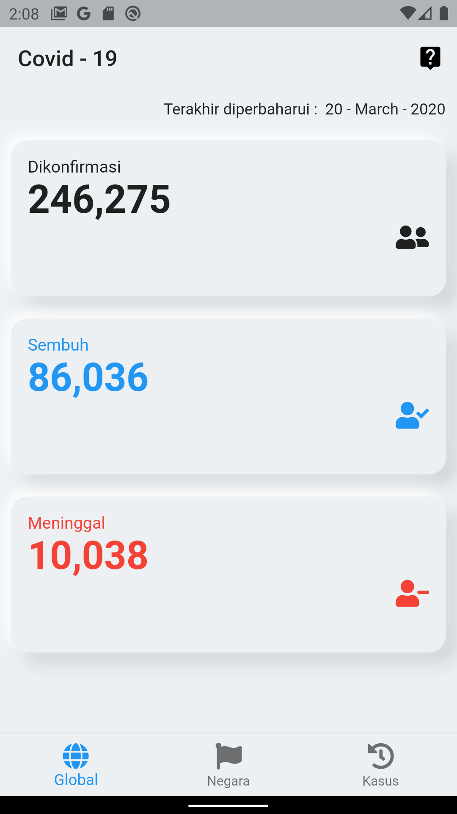
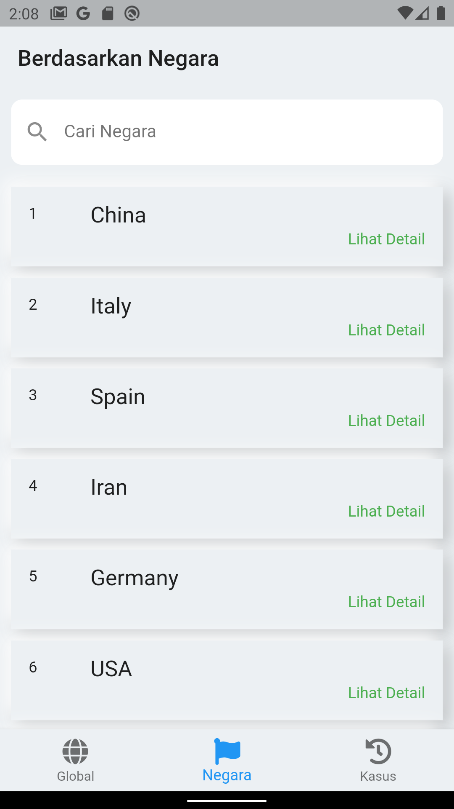
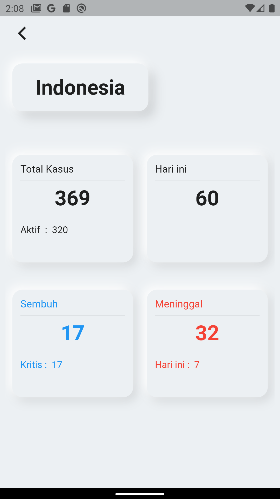
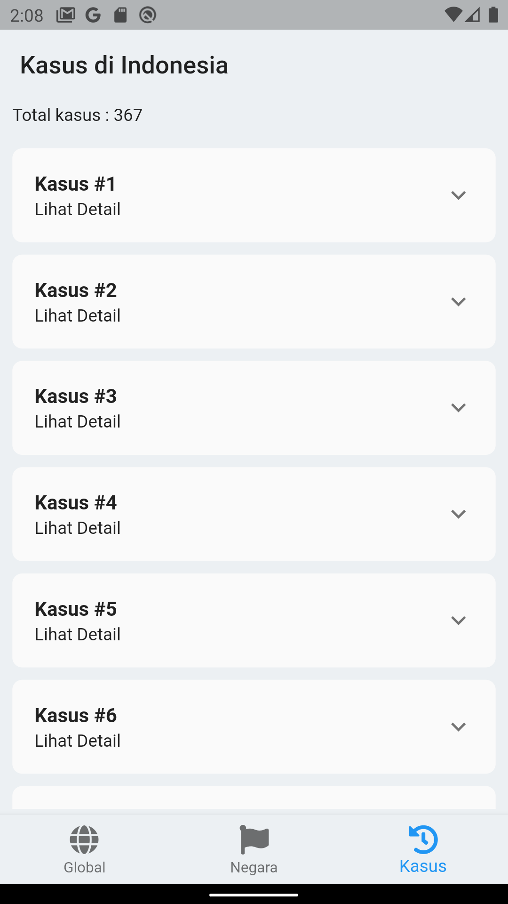

#covid19_app

<h1>Covid-19 Monitoring</h1>

This project is a starting point for a Flutter application.

Download Aplikasi :
- [Download Disini](https://github.com/febryardiansyah/covid19_app/releases)

Rest Api :

- [Covid Api-19 by Mathroid](https://github.com/mathdroid/covid-19-api)
- [NovelCovid Api](https://github.com/NovelCOVID/API)
- [Covid-19 Cluster by louislugas](https://louislugas.github.io/covid_19_cluster/json/kasus-corona-indonesia.json)

Screenshot:

- Global Data 
 
- Berdasarkan Negara 
 
- Lihat Detail 
 
- History 
 

